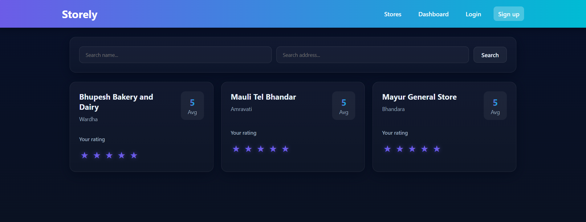

# Store Ratings Platform

Role-based store ratings app with Express/Sequelize/MySQL backend and React (Vite) frontend.

## Tech Stack
- Backend: Node.js, Express, Sequelize, MySQL
- Frontend: React, Vite, Axios

## Current Data
Stores:
1) Bhupesh Bakery and Dairy — Wardha  
2) Mauli Tel Bhandar — Amravati  
3) Mayur General Store — Bhandara
`

## Prerequisites
- Node.js 18+ and npm
- MySQL running locally

## Backend (port 4004)
1) Configure env:
```cmd
cd backend
copy .env
# then edit .env with your DB creds (DB_NAME, DB_USER, DB_PASS, DB_HOST, DB_PORT, JWT_SECRET)
```

2) Install & run:
```cmd
npm install
npm run dev
```


## Frontend (default port 5173)
1) Install & run:
```cmd
cd frontend
npm install
npm run dev
```

2) API base URL: the frontend defaults to `http://localhost:4004` via `src/api.js`. If you change the backend port, set an env var before running Vite:
```cmd
set VITE_API_BASE=http://localhost:4004
npm run dev
```

## Typical Flow
- Anyone can browse stores.
- Login required to rate.
- Normal user: rates stores, sees “Your Ratings” on dashboard.
- Store owner: sees owned stores and ratings on dashboard.
- Admin: sees totals and recent ratings on dashboard.

## Useful Scripts (backend)
- `npm run dev` — start backend with nodemon


## Screenshots

### Admin Dashboard


### Store Owner Dashboard


### Normal User Dashboard


### General Dashboard



